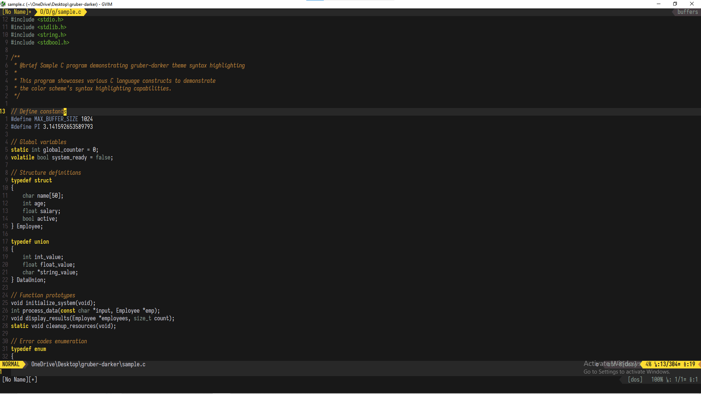
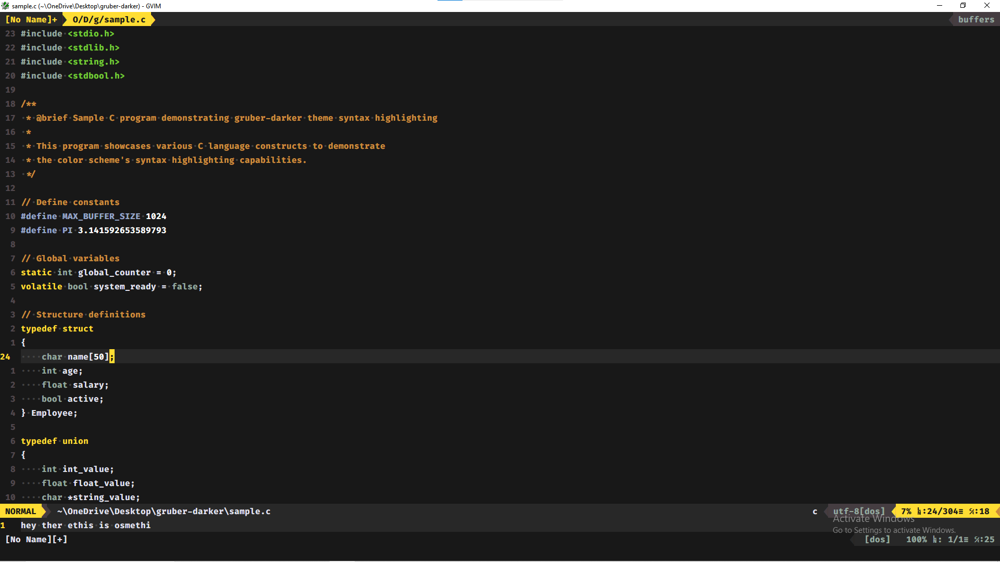

# gruber-darker.vim

[](https://opensource.org/licenses/MIT)
[](https://www.vim.org/)
[](https://neovim.io/)
[](https://github.com/ThunderBoltCODMYT/gruber-darker.vim/releases)

A faithful, Robust, and pixel perfect Vim/Neovim colorscheme port of the renowned [gruber-darker-theme.el](https://github.com/rexim/gruber-darker-theme) by Jason R. Blevins and Alexey Kutepov (rexim) originally made for [GNU Emacs](https://www.gnu.org/software/emacs/).

> [!NOTE]
> this work is Licensed under the [MIT License](https://opensource.org/licenses/MIT) as you can see [here.](./LICENSE.md)

## ✨ Key Features

- **Pixel-perfect color fidelity** to the original Emacs implementation
- **Cross-platform compatibility** supporting Vim 8.0+ and Neovim 0.5+
- **Comprehensive plugin ecosystem integration**:
  - vim-airline statusline themes
  - lightline colorschemes
  - lualine statusline themes
  - Treesitter syntax highlighting (85+ highlight groups)
  - LSP diagnostic integration
- **Language-specific syntax optimizations** for C, C++, Java, and C#
- **Extensive customization framework** with robust input validation
- **Professional-grade documentation** with integrated Vim help system
- **Runtime configuration commands** for dynamic theme adjustments

## Screenshots:

#### preview.png



#### my_setup.png



## 🚀 Installation & Setup

### Plugin Manager Installation

#### Vim-Plug

```vim
call plug#begin('~/.vim/plugged')
Plug 'ThunderBoltCODMYT/gruber-darker.vim'
call plug#end()
```

#### Packer (Neovim)

```lua
use {
  'ThunderBoltCODMYT/gruber-darker.vim',
  config = function()
    vim.cmd('colorscheme gruber-darker')
  end
}
```

#### Lazy (Neovim)

```lua
{
  'ThunderBoltCODMYT/gruber-darker.vim',
  lazy = false,
  priority = 1000,
  config = function()
    vim.cmd('colorscheme gruber-darker')
  end,
}
```

### Manual Installation

#### Vim (Unix/Linux/macOS)

```bash
git clone https://github.com/ThunderBoltCODMYT/gruber-darker.vim \
  ~/.vim/pack/themes/start/gruber-darker
```

#### Vim (Windows)

```cmd
git clone https://github.com/ThunderBoltCODMYT/gruber-darker.vim ^
  %USERPROFILE%\vimfiles\pack\themes\start\gruber-darker
```

#### Neovim (Unix/Linux/macOS)

```bash
git clone https://github.com/ThunderBoltCODMYT/gruber-darker.vim \
  ~/.config/nvim/pack/themes/start/gruber-darker
```

#### Neovim (Windows)

```cmd
git clone https://github.com/ThunderBoltCODMYT/gruber-darker.vim ^
  %LOCALAPPDATA%\nvim\pack\themes\start\gruber-darker
```

### Basic Configuration

```vim
" Enable 24-bit color support
set termguicolors

" Load the colorscheme
colorscheme gruber-darker

" Optional: Configure statusline theme
let g:airline_theme = 'gruber_darker'
```

## 🎨 Color Palette Reference

| Color Name | Hex Code  | Terminal Code | Semantic Usage                         |
| ---------- | --------- | ------------- | -------------------------------------- |
| `fg`       | `#e4e4ef` | `253`         | Primary text foreground                |
| `bg`       | `#181818` | `234`         | Primary background                     |
| `yellow`   | `#ffdd33` | `220`         | Keywords, control flow, emphasis       |
| `green`    | `#73c936` | `76`          | String literals, success states        |
| `niagara`  | `#96a6c8` | `147`         | Functions, methods, information        |
| `quartz`   | `#95a99f` | `108`         | Data types, documentation              |
| `wisteria` | `#9e95c7` | `98`          | Special constructs, constants          |
| `brown`    | `#cc8c3c` | `172`         | Comments, warnings                     |
| `red`      | `#f43841` | `196`         | Errors, deletions, destructive actions |

## ⚙️ Configuration Options

### Core Options

```vim
" Background contrast: 'soft', 'medium', 'hard'
let g:gruber_contrast = 'medium'

" Feature toggles (0 = disabled, 1 = enabled)
let g:gruber_transparent_bg = 0
let g:gruber_bold_keywords = 1
let g:gruber_italic_comments = 1
```

### Advanced Customization

#### Palette Overrides

```vim
let g:gruber_palette = {
  \ 'yellow': ['#ffee00', 226],
  \ 'green': ['#7fdf40', 77],
  \ 'niagara': ['#a0b6d8', 152]
  \ }
```

#### Highlight Group Overrides

```vim
let g:gruber_custom_highlights = {
  \ 'CursorLine': 'guibg=#202020',
  \ 'Comment': 'guifg=#999999 gui=italic',
  \ 'Todo': 'guifg=#000000 guibg=#ffff00 gui=bold'
  \ }
```

## 🛠️ Runtime Commands

| Command                    | Description                                                     |
| -------------------------- | --------------------------------------------------------------- |
| `:GruberContrast {level}`  | Dynamically adjust background contrast (`soft`/`medium`/`hard`) |
| `:GruberHealth`            | Execute comprehensive environment diagnostics                   |
| `:GruberInfo`              | Display current configuration and palette values                |
| `:GruberToggleTransparent` | Toggle transparent background mode                              |
| `:GruberToggleBold`        | Toggle bold rendering for keywords                              |
| `:GruberToggleItalic`      | Toggle italic rendering for comments                            |
| `:GruberHelp`              | Access integrated help documentation                            |

## 🔧 Plugin Integration

### vim-airline

```vim
let g:airline_theme = 'gruber_darker'
let g:airline_powerline_fonts = 1
```

### lightline

```vim
let g:lightline = { 'colorscheme': 'gruber_darker' }
```

### lualine (Neovim)

```lua
require('lualine').setup {
  options = { theme = 'gruber-darker' }
}
```

### Treesitter (Neovim)

```lua
require('nvim-treesitter.configs').setup {
  ensure_installed = { "c", "cpp", "java", "lua" },
  highlight = { enable = true }
}
```

## 📖 Documentation

Comprehensive documentation is available through Vim's integrated help system:

```vim
" Generate help tags (run once after installation)
:helptags ALL

" Access documentation
:help gruber-darker
```

The documentation covers:

- Detailed installation procedures
- Complete configuration reference
- Plugin integration guides
- Troubleshooting procedures
- API documentation

## 🔍 Diagnostics & Troubleshooting

### Environment Verification

```vim
" Check true color support
:echo has('termguicolors')

" Run comprehensive diagnostics
:GruberHealth

" View current configuration
:GruberInfo
```

### Common Issues

**Colors appear incorrect:**

- Ensure `set termguicolors` is configured
- Verify terminal emulator supports 24-bit color
- Check Vim version compatibility (8.0+ required)

**Italic text not rendering:**

- Confirm terminal and font support italic variants
- Check `&t_ZH` and `&t_ZR` terminal codes
- Disable with `let g:gruber_italic_comments = 0`

**Theme not loading:**

- Verify installation path and runtime configuration
- Check for conflicting colorschemes
- Ensure proper plugin manager setup

## Contributions

You can see the [CONTRIBUTING.md here](./CONTRIBUTING.md)

### Development Guidelines

- Follow Vimscript best practices
- Include comprehensive error handling
- Maintain backward compatibility
- Update documentation for new features
- Test across multiple platforms and configurations

## Credits

- **Jason R. Blevins** and **Alexey Kutepov (rexim)** for the original Emacs theme
- All contributors who have helped improve this port

## Support

- **Issues**: [GitHub Issues](https://github.com/ThunderBoltCODMYT/gruber-darker.vim/issues)
- **Discussions**: [GitHub Discussions](https://github.com/ThunderBoltCODMYT/gruber-darker.vim/discussions)
- **Documentation**: `:help gruber-darker` (after installation)

---

**Version**: 1.0.0 
**Release Date**: March 19, 2026
**Repository**: <https://github.com/ThunderBoltCODMYT/gruber-darker.vim>
**Author**: ThunderBoltCODMYT
